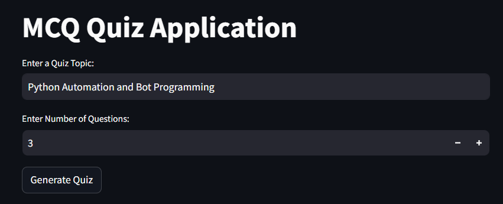
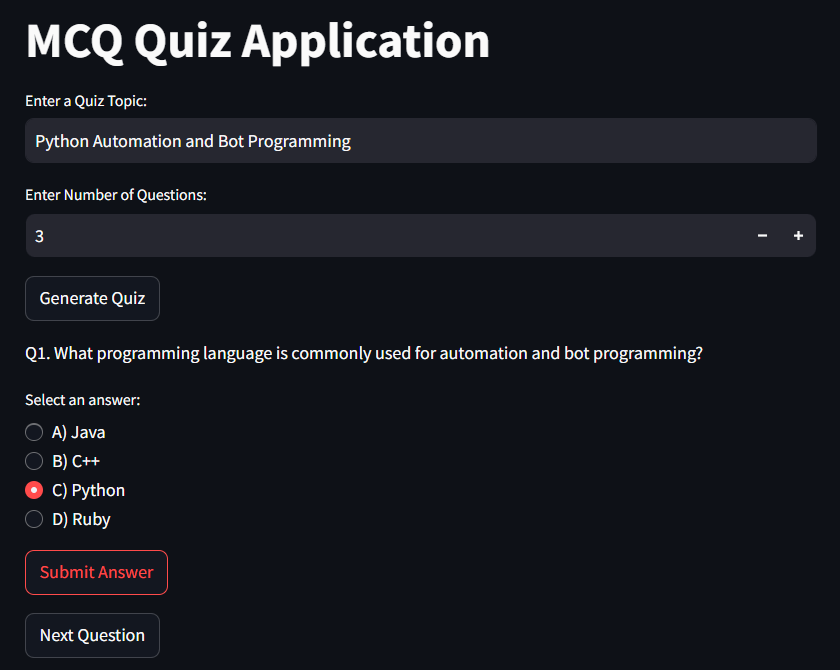
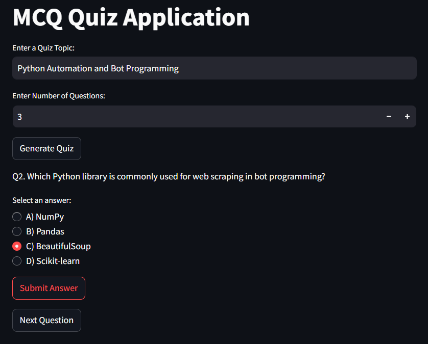
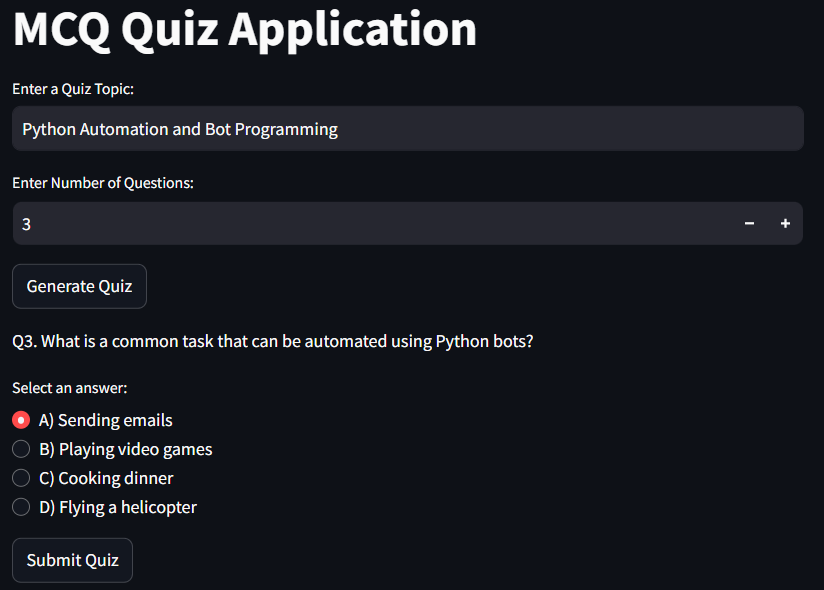
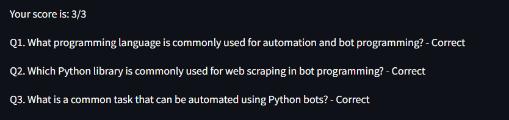

# **Interactive Quiz Application**

A Python-based multiple-choice quiz application that generates quizzes dynamically using OpenAI's GPT API. The app is built with **Streamlit** for a user-friendly interface and supports customized quizzes based on user-selected topics.

---

## 🌟 **Features**
- Generate dynamic multiple-choice quizzes using OpenAI's Chat Completion API.
- User-friendly interface built with Streamlit.
- Customizable topics and number of questions.
- Real-time scoring and feedback for quiz results.

---

## 🛠️ **Technologies Used**
- **Python**: Core language for backend logic.
- **Streamlit**: Frontend framework for building the UI.
- **OpenAI API**: For generating quiz questions and answers.
- **Python-dotenv**: For managing sensitive API keys securely.

---

## **Project Structure**
```
Interactive-Quiz-Application/ 
├── main.py 
├── requirements.txt 
├── .env # Environment variables (ignored by Git) 
└── venv/ # Virtual environment (ignored by Git)
```

## **Installation**
### Prerequisites
- Python 3.8 or higher
- An OpenAI API key

### Steps
1. Clone the repository:
   ```bash
   git clone https://github.com/Qosay-AlShatel/Interactive-Quiz-Application.git
   cd Interactive-Quiz-Application

2. Create a virtual environment:
   ```bash
   python -m venv venv
   source venv/bin/activate  # On Windows: venv\\Scripts\\activate

3. Install the dependencies:
   ```bash
   pip install -r requirements.txt

4. Create a .env file in the project root directory and add your OpenAI API key:
   ```bash
   OPENAI_API_KEY=your_api_key_here

---

## **Usage**
1. Run the application:
   ```bash
   streamlit run main.py
2. Open the application in your browser (default: http://localhost:8501).

3. Enter a topic and specify the number of questions, then enjoy your quiz!

---

##  Screenshots
### Choose the topic of the quiz and number of questions


### First Question


### Second Question


### Third Question


### Score


---

## Contributions  
Contributions are welcome! Please fork this repository and open a pull request to add more features or fix issues.  


